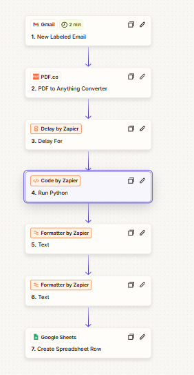
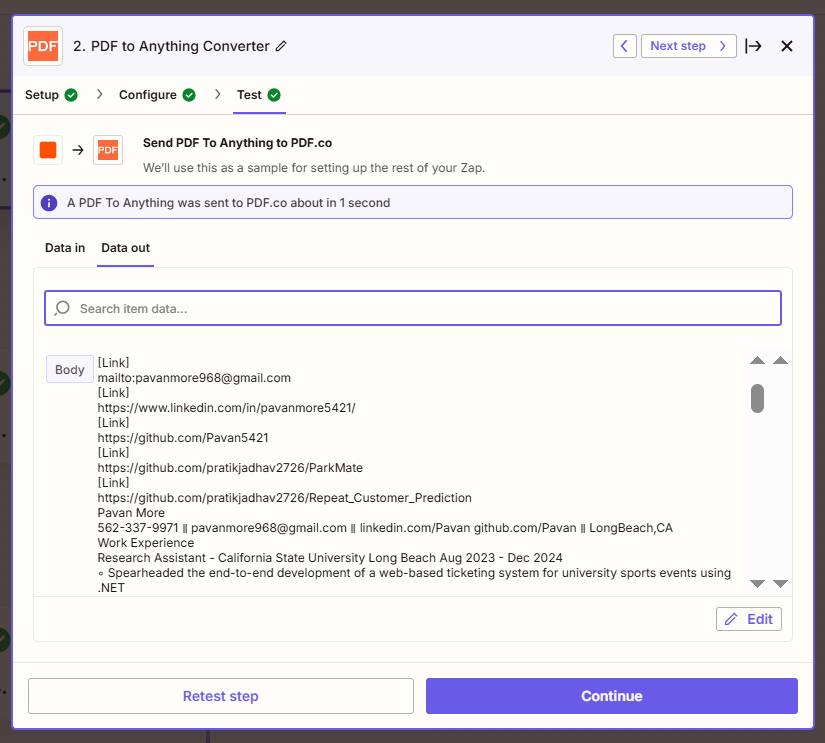
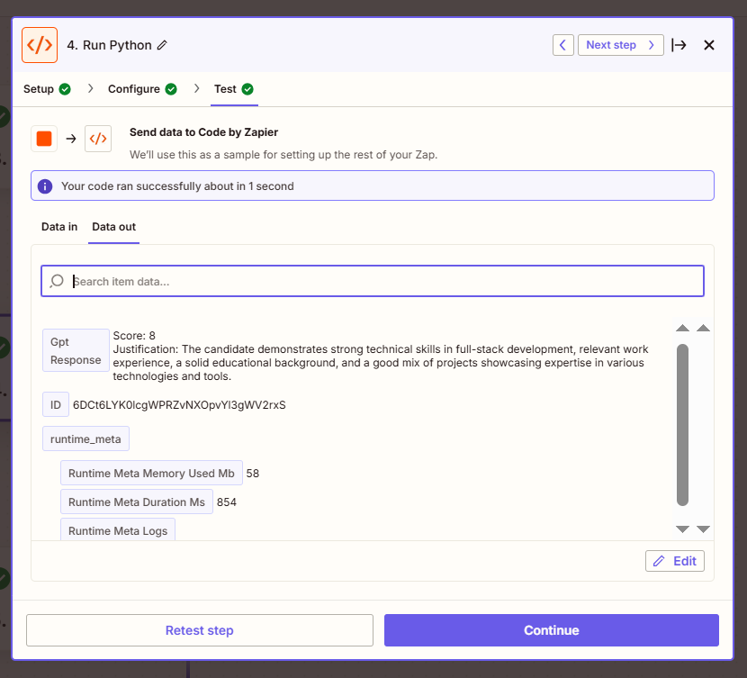
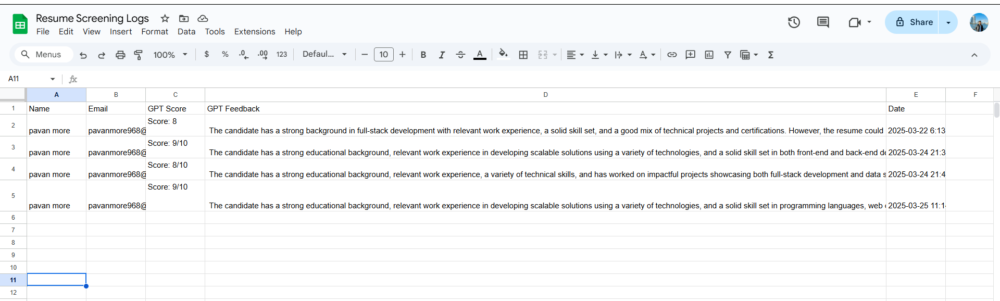

# 🤖 AI-Powered Resume Screening Automation

This project automates the resume screening process using **Zapier**, **PDF.co**, **OpenAI GPT-3.5**, and **Google Sheets**. It mimics a recruiter’s workflow by extracting resume content, analyzing it with GPT, and logging the evaluation for easy review — cutting down manual screening time by up to **80%**.

---

## 🚀 Tech Stack & Tools
- **Zapier** – No-code multi-step automation
- **PDF.co** – Extract resume text from PDF attachments
- **OpenAI GPT-3.5** – Score resumes and provide human-like justifications
- **Python (Zapier Code Step)** – API integration and logic handling
- **Google Sheets** – Final structured log of results
- **Gmail** – Resume entry point

---

## ⚙️ Workflow Overview

1. 📬 **Trigger**: New email labeled `Resumes` in Gmail  
2. 📄 **Parse**: PDF.co extracts text from attached resume  
3. ⏳ **Delay**: Zapier pauses briefly to avoid API rate limits  
4. 🤖 **Evaluate**: Resume sent to OpenAI API for scoring and reasoning  
5. 🧩 **Formatter**: GPT output is split into score + feedback  
6. 📊 **Log**: Final results saved in Google Sheets

---

## 📸 Screenshots

### 🔁 Zapier Automation Flow  

### 📄 Resume Text Extracted from PDF  

### 🤖 GPT Evaluation Response  

### 📊 Final Results Logged in Google Sheets  

---

## 💡 Features

- Full resume parsing and scoring automation
- GPT-based candidate evaluation (score + short feedback)
- One-click resume tracking and ranking via Google Sheets
- Easy to scale and customize for different job roles
- No manual screening required

---

## 📈 Impact

- ⏱️ **Reduced manual resume screening time by 80%**
- 📥 Evaluates all resumes received via Gmail with consistent logic
- 💡 Ideal for small HR teams, early-stage startups, or freelance recruiters

---

## 🧩 Future Enhancements

- Role-specific scoring using dynamic job titles
- JD-to-resume matching for better candidate fit analysis
- Auto-response emails for shortlisted candidates
- Integration with ATS platforms like Workable or Greenhouse

---

## 🧠 Learnings

- End-to-end automation using no-code and low-code tools
- Real-world application of GPT API for decision-making
- API orchestration using Zapier, Python, and Webhooks

---

## 🔐 Requirements

- OpenAI API Key  
- PDF.co API Key  
- Zapier Account (Free tier works for basic flows)  
- Google Account for Sheets & Gmail integration

---

## 📬 Feedback & Collaboration

Have ideas to improve this workflow? Want to integrate it into your recruiting stack or HR project?  
Let’s connect — happy to collaborate or improve on this together!

